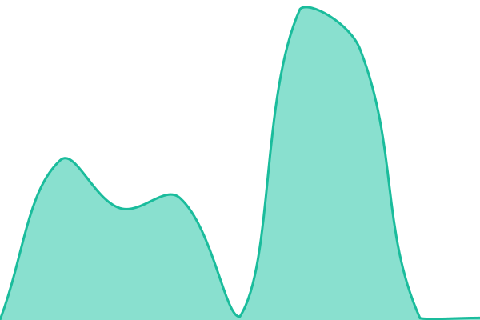
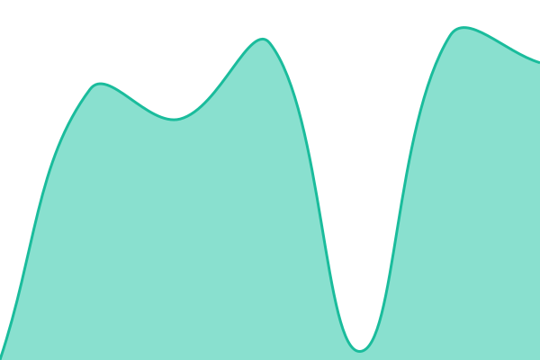

# [📈 Live Status](https://xmlans.github.io/apistatus): <!--live status--> **🟩 All systems operational**

This repository contains the open-source uptime monitor and status page for [兰酱 qwq](https://www.xmlans.com), powered by [Upptime](https://github.com/upptime/upptime).

With [Upptime](https://upptime.js.org), you can get your own unlimited and free uptime monitor and status page, powered entirely by a GitHub repository. We use [Issues](https://github.com/xmlans/apistatus/issues) as incident reports, [Actions](https://github.com/xmlans/apistatus/actions) as uptime monitors, and [Pages](https://xmlans.github.io/apistatus) for the status page.

<!--start: status pages-->
<!-- This summary is generated by Upptime (https://github.com/upptime/upptime) -->
<!-- Do not edit this manually, your changes will be overwritten -->
<!-- prettier-ignore -->
| URL | Status | History | Response Time | Uptime |
| --- | ------ | ------- | ------------- | ------ |
|  [Official MiniMax API](https://api.xmyun.org/v1/chat/completions) | 🟩 Up | [Minimax.yml](https://github.com/xmlans/apistatus/commits/HEAD/history/Minimax.yml) | 

 1504ms
     
 | 

<a href="https://xmlans.github.io/apistatus/history/Minimax">57.62%</a>
    

|  [Official DeepSeek API](https://api.xmyun.org/v1/chat/completions) | 🟩 Up | [DeepSeek.yml](https://github.com/xmlans/apistatus/commits/HEAD/history/DeepSeek.yml) | 

 1990ms
     
 | 

<a href="https://xmlans.github.io/apistatus/history/DeepSeek">57.62%</a>
    

|  [Third Party Minimax](https://api.xmyun.org/v1/chat/completions) | 🟩 Up | [Minimax-Third.yml](https://github.com/xmlans/apistatus/commits/HEAD/history/Minimax-Third.yml) | 

 886ms
     
 | 

<a href="https://xmlans.github.io/apistatus/history/Minimax-Third">57.63%</a>
    

<!--end: status pages-->

[**Visit our status website →**](https://xmlans.github.io/apistatus)

## 📄 License

- Powered by: [Upptime](https://github.com/upptime/upptime)
- Code: [MIT](./LICENSE) © [Anand Chowdhary](https://anandchowdhary.com)
- Data in the `./history` directory: [Open Database License](https://opendatacommons.org/licenses/odbl/1-0/)
